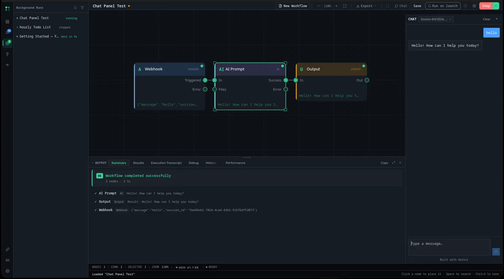
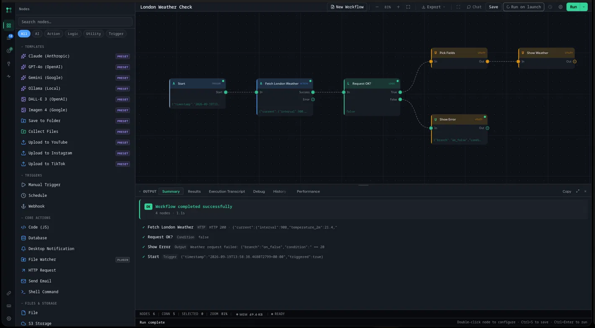
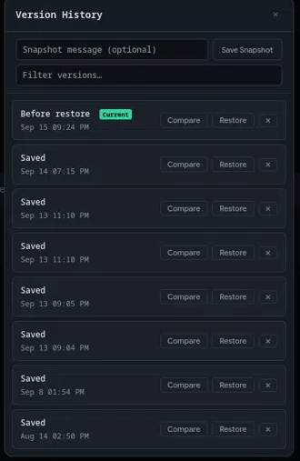
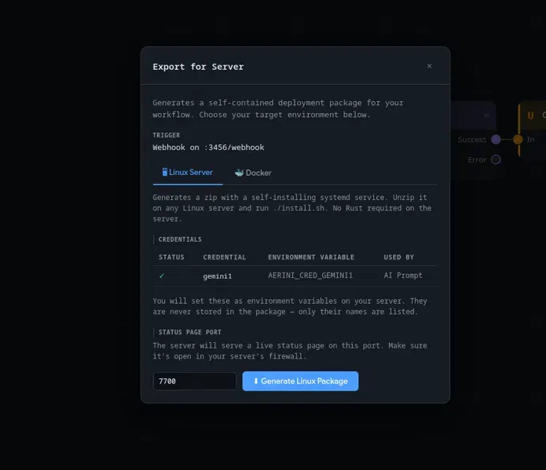

# Aerini

Aerini is a visual workflow automation app for macOS, Windows, and Linux. Drag nodes onto a canvas, wire them together, and run the result by hand, on a schedule, or from a webhook.

No account, no cloud, no subscription. Everything runs on your machine unless you point a node at something else.

Aerini is pre-1.0 and under active development. The workflow file format and internal APIs can still change before a 1.0 release.



Get it at **[aerini.org](https://aerini.org/)**, or from the [Releases page](https://github.com/Panchak2d/aerini/releases) if you'd rather skip the website. Docs live in [`docs/`](docs/index.md). Pricing for the commercial license is at [aerini.org/pricing](https://aerini.org/pricing).

## What you can build

- A morning report that pulls numbers from an API, reshapes them, and emails or Slacks the result

- An alert that checks something on a timer and only speaks up when it looks wrong

- A webhook receiver for GitHub or Stripe that runs your logic and sends a notification

- A small AI pipeline: prompt a model, transform what comes back, hand it to the next node

- File and data shuffling: read something, change it, write it somewhere else

- Generating images or text with AI and uploading the result straight to YouTube, Instagram, or TikTok

If it can be described as "when this happens, do these steps," it's a workflow.

## Building one

The left sidebar lists every node, grouped by category, with search and one-click presets for the AI providers and platforms you'll reach for most (Claude, GPT-4o, Gemini, Ollama, DALL-E 3, Imagen 4, plus ready-to-go Save to Folder and Upload nodes). Drop nodes on the canvas, connect their ports, hit Run. The panel underneath shows a summary, the raw results, an execution transcript, a debug view, and run history, so when something fails you're not guessing where.



Conditions branch with True/False outputs, a Loop node runs a sub-flow once per item, and Switch handles more than two paths. Anything downstream can pull in an upstream node's output with `{{Node Name.output.field}}`; see [Expressions](docs/guide/expressions.md) for the full syntax.

## 40 nodes, seven categories

| Category | Nodes |
| - | - |
| **Triggers** | Manual Trigger, Webhook, Schedule |
| **Core Actions** | HTTP Request, Shell Command, Code (JS), Send Email, Desktop Notification, Database |
| **Files & Storage** | File, Save to Folder, S3 Storage, Social Upload |
| **Integrations** | Slack, Discord, GitHub, Google Sheets, Notion, Telegram, SendGrid, Stripe |
| **AI** | AI Prompt, AI Agent, AI Memory, Text Splitter, Image Generation |
| **Logic** | If / Condition, Switch, Loop (For Each), Stop, Merge, Collect Files |
| **Utility** | Delay, Wait, Transform Data, JSON, Set Variable, Get Variable, Text to File, Output |


Full parameters and outputs for each one: [Nodes Reference](docs/guide/nodes.md).

## Every change is a version you can get back

Aerini snapshots your workflow automatically as you edit, and you can save a named snapshot yourself before trying something risky. Version History compares any two snapshots field by field and restores either one. No more "I changed something three days ago and can't remember what."



## Plugins

Node types you write yourself. Compile a Rust crate to `wasm32-wasip2`, then either drop the `.wasm` file (or an `.aerinipkg` bundle, if it's more than one node) onto the Aerini window, or install it from the dedicated Plugins panel. It shows up in the palette tagged as a Plugin, right next to the built-ins.

Each plugin call runs sandboxed in its own Wasmtime instance: no filesystem access, a 64 MiB memory cap, and a 30-second wall-clock deadline per call. Outbound HTTP is allowed but filtered the same way built-in nodes are, so a plugin can't be used to reach your internal network. Aerini shows a signature status for every installed plugin (unsigned is normal for most community plugins, not a red flag by itself) and surfaces load errors instead of silently dropping a bad build.


Start with [Plugin Authoring](docs/development/plugin-authoring.md), or copy `examples/plugin-template/`.

## Background runs and keeping an eye on things

A workflow with a Schedule or Webhook trigger keeps running while you work on something else. You don't need the canvas open. The Background Runs panel lists everything currently running, idle, or stopped; the Monitor panel next to it tracks memory use and lets you start or stop everything at once.


More on triggers and run history: [Background Runs](docs/guide/background-runs.md).

## Running it unattended

Aerini itself is built for one person on one machine, but a workflow can run without the desktop app open. `aerini-server` is the headless binary for that.

Click **Export → Export for Server** on a workflow to generate a deployment package. The Linux Server target produces a zip with a self-installing systemd service, no Rust or Node required on the box you're deploying to.  
  
  


`aerini-server` also has an `api` mode for running several workflows behind a real REST API with token auth, for when one exported workflow isn't enough. No prebuilt server binary is published yet, only the desktop installers, so building one yourself (Docker or from source) is currently the only way to get one. Full details: [Server Deployment](docs/operations/server-deploy.md).

## Using the engine in your own program

`aerini-engine` is a plain Rust crate: no Tauri, no UI dependency. Pull it into your own program, register your own nodes alongside or instead of the 40 built-ins, supply your own credential resolver and event sink, and run workflows headless. It's the same engine behind the desktop app and `aerini-server`, so retries, parallel execution, expressions, and plugins all behave the same way embedded as they do anywhere else.

See [Embedding aerini-engine](docs/development/embedding.md) for a working example and what's safe to depend on across versions.

## Requirements (building from source)

| Tool | Version | Why |
| - | - | - |
| Rust (stable) | 1.95+ | Builds the engine and desktop shell |
| Node.js | 20.19+, 22.13+, or 24+ | Only to run the frontend build, not needed to use the app itself |
| Tauri CLI | 2.x | Packages the desktop app |


The Code (JS) node runs on a Node.js runtime bundled inside Aerini. You don't need Node.js installed to use that node, only to build Aerini from source.

## Installing

Download the installer for your OS from **[aerini.org](https://aerini.org/)**, or grab the same files from the [Releases page](https://github.com/Panchak2d/aerini/releases): `.dmg` for macOS, `.msi` or `.exe` for Windows, `.deb` or `.AppImage` for Linux. No terminal needed.

A few things worth knowing before your first launch:

- **macOS** builds are Apple Silicon only right now, no Intel build yet. The app isn't signed with an Apple Developer certificate, so right-click it and choose Open the first time instead of double-clicking, or Gatekeeper will block it.

- **Windows** installers aren't code-signed either, so SmartScreen will warn you. Click "More info," then "Run anyway." Normal for a project this size, not a sign anything's wrong.

- **Linux** needs `webkit2gtk` 4.1, which most desktops already have. If Aerini won't launch and complains about a missing shared library, install `webkit2gtk-4.1` first (e.g. `libwebkit2gtk-4.1-0` on Debian/Ubuntu).

Once it's running, [Getting Started](docs/getting-started/getting-started.md) walks through building and scheduling your first workflow.

### Building from source

```
git clone https://github.com/Panchak2d/aerini      
cd aerini      
npm install      
./scripts/fetch-node-binaries.sh      
npm run dev
```

`fetch-node-binaries.sh` downloads and checksum-verifies the Node.js runtime Aerini bundles for the Code (JS) node. It's a one-time step per clone and the build fails without it. Needs `curl`, `tar`, `unzip` (or `powershell.exe` on Windows), and `sha256sum`/`shasum` on your PATH.

The first build takes a few minutes while Rust compiles. After that, changes rebuild in seconds. `npm run build` produces a standalone installer under `src-tauri/target/release/bundle/`.

> `dist/` is committed on purpose, Tauri reads frontend assets from it at build time. Don't add it to `.gitignore`. Details in [CONTRIBUTING.md](CONTRIBUTING.md).

## Documentation

| Guide | What it covers |
| - | - |
| [Introduction](docs/index.md) | What Aerini is, who it's for, what it can't do |
| [Installation](docs/getting-started/installation.md) | Downloading and installing on each OS |
| [Getting Started](docs/getting-started/getting-started.md) | Build your first workflow, run it, schedule it |
| [Concepts](docs/getting-started/concepts.md) | What a workflow is, what a node is, how it fits together |
| [Glossary](docs/glossary.md) | Every term used across these docs, defined plainly |
| [Nodes Reference](docs/guide/nodes.md) | Every built-in node: parameters, outputs, what it does |
| [Keyboard Shortcuts](docs/guide/keyboard-shortcuts.md) | Every shortcut, grouped the same way as the in-app list |
| [Expressions](docs/guide/expressions.md) | `{{...}}` syntax for wiring node outputs into other nodes |
| [Credentials](docs/guide/credentials.md) | Storing API keys and setting up every supported service |
| [Background Runs](docs/guide/background-runs.md) | Schedules, webhook triggers, run history |
| [Version History](docs/guide/version-history.md) | Automatic and named snapshots, comparing, restoring |
| [Plugins](docs/guide/plugins.md) | Installing and managing a `.wasm` plugin node |
| [Monitor](docs/guide/monitor.md) | Memory use and run status across every workflow at once |
| [Examples](docs/guide/examples.md) | Worked example workflows in [`examples/`](examples/) |
| [Troubleshooting](docs/troubleshooting.md) | Common problems, by symptom |
| [FAQ](docs/faq.md) | Short answers to common questions |
| [Security](docs/guide/security.md) | Encryption, dangerous nodes, SSRF protection, hardening a server |
| [Chat Panel](docs/guide/chat-panel.md) | Chatting with a workflow inside the desktop app |
| [Widget Embedding](docs/guide/widget-embedding.md) | Dropping the chat widget into a web page |
| [Local Models](docs/guide/local-models.md) | Using Ollama and other OpenAI-compatible local servers |
| [Server Deployment](docs/operations/server-deploy.md) | Running workflows 24/7 on Docker or a Linux box |
| [Server CLI Reference](docs/operations/server-cli-reference.md) | Every `aerini-server serve`/`api` flag |
| [Server API Reference](docs/operations/server-api-reference.md) | REST endpoints, SSE events, scoped tokens |
| [Updating](docs/operations/updating.md) | Desktop updates, server binary updates, workflow schema migration |


Developer guides:

| Guide | What it covers |
| - | - |
| [Architecture](docs/development/architecture.md) | How the engine, Tauri shell, and server binary fit together |
| [Embedding aerini-engine](docs/development/embedding.md) | Using the engine as a Rust library in your own program |
| [Custom Node Authoring](docs/development/node-authoring.md) | Adding a new built-in node type |
| [Plugin Authoring](docs/development/plugin-authoring.md) | Writing and distributing `.wasm` plugin nodes |
| [Desktop IPC Reference](docs/development/desktop-ipc-reference.md) | Every command the frontend can call into the Tauri shell |
| [Workflow File Format](docs/reference/workflow-file-format.md) | The `.aerini`/`.json` schema |
| [Schema Migrations](docs/reference/schema-migrations.md) | How the workflow format changes across versions |
| [Testing](docs/development/testing.md) | Where tests live and how to run them |


## License

[GNU Affero General Public License v3.0](LICENSE) (AGPL-3.0).

- You can use, modify, and self-host Aerini freely.

- If you distribute a modified version of Aerini — including running a modified `aerini-server` as a network service for others — you have to publish those modifications under AGPL-3.0 too.

- Running the **unmodified** binary as an internal tool for your own team doesn't trigger that.

### Need a commercial license?

A commercial license removes the copyleft obligation for one named product or service of yours: no source disclosure, proprietary modifications allowed, and no limit on that product's end customers. Each additional product needs its own license. The license also requires you to pass its AI-training restriction on to your own end customers. You probably want one if you're building a product or SaaS on top of Aerini, distributing a modified copy to clients, running a modified `aerini-server` as a service for others, or your legal team wants a license certificate on file. You accept the terms electronically at checkout and the certificate is issued automatically, so there is nothing to sign. The software itself is provided as-is, with no warranty.

[Pricing](https://aerini.org/pricing) · [License terms](https://aerini.org/license-terms) · [`COMMERCIAL-LICENSE.md`](COMMERCIAL-LICENSE.md) · enterprise or volume licensing: [CONTACT.md](CONTACT.md)

See [Why Aerini is dual-licensed](docs/dual-licensing.md) for the reasoning behind this model, including why a CLA is required from contributors.

## Privacy

No telemetry, no analytics, no crash reports. The only outbound connection Aerini's own interface makes on its own is loading the Inter font from Google Fonts over HTTPS, everything else is whatever your workflows are configured to do. See [Security §Desktop security model](docs/guide/security.md#desktop-security-model), or the [transparency report template](transparency/TEMPLATE.md) for the full audit trail.

## Contributing

Contributions welcome, see [CONTRIBUTING.md](CONTRIBUTING.md). A CLA is required before your first PR merges. CLA Assistant posts a one-click sign link on the PR itself, GitHub OAuth, takes a few seconds.

## Community & support

- Questions, workflow help, feature ideas: [GitHub Discussions](https://github.com/Panchak2d/aerini/discussions)

- Bugs: [GitHub Issues](https://github.com/Panchak2d/aerini/issues)

- Funding development directly: [Patreon](https://www.patreon.com/c/Panchak2d)

