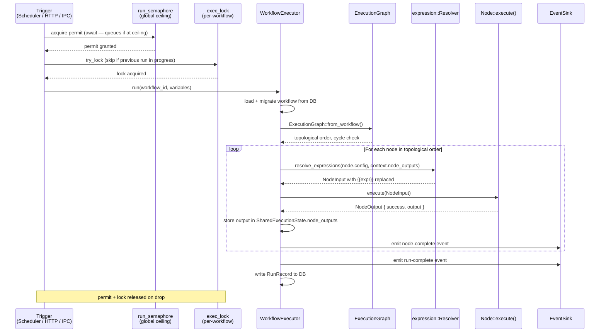

# Execution Flow — Internals

How Aerini turns a saved workflow JSON into a completed run. This page is for contributors and embedders, not for general use.

---

## Overview

Every execution flows through a single entry point: `WorkflowExecutor::run()` in `aerini-engine/src/executor/mod.rs`.

---

## 1. Trigger

Runs originate from three sources:

| Source | Code path |
|---|---|
| Scheduler (interval / cron / once / webhook) | `scheduler/mod.rs` → `fire_once_with_vars()` |
| Server HTTP `/run` endpoint | `aerini-server/src/api_server/routes/workflows.rs` |
| Tauri IPC `run_workflow` command | `src-tauri/src/lib.rs` |

All three converge on `WorkflowExecutor::run()`. The trigger type is stored in the `ExecutionContext` metadata map.

---

## 2. Concurrent-run control

Two guards are acquired before any executor is constructed:

**Global semaphore** (`run_semaphore`) — caps total simultaneous executions across all workflows. Default: 16 (configurable with `--max-concurrent-runs`). Acquiring this semaphore *queues* the run rather than rejecting it. The scheduler blocks until a slot opens; the server returns HTTP 429 if no slot opens within the queue timeout.

**Per-workflow mutex** (`exec_lock`) — ensures at most one instance of a given workflow runs at a time. If the lock can't be acquired (a run is already active), the attempt is skipped with a "previous run still in progress" log entry. This is not an error — it's intentional back-pressure.

Both guards are released automatically on drop when the run completes.

---

## 3. Workflow loading

The executor reads the workflow from `WorkflowDb`, applies any pending schema migrations (`migration.rs`), then deserializes the result into a `Workflow` struct (`model.rs`).

If `schema_version` differs from `CURRENT_VERSION`, the migration chain runs upgrade functions in sequence until the workflow reaches the current schema. This is invisible to the caller — it happens inside `Workflow::from_json()` every time a workflow is loaded.

---

## 4. Graph construction

`ExecutionGraph::from_workflow()` converts the flat `nodes` and `edges` list into a directed acyclic graph using `petgraph`. It validates:

- No cycles (a cycle means the workflow can never terminate)
- All edge references resolve to known node IDs
- At least one node with no incoming edges (the trigger)

If validation fails, the executor emits a `workflow-error` event and returns without running. The error is visible in the output drawer.

---

## 5. Expression resolution

Before a node executes, its config map is walked by the expression resolver (`expression/resolver.rs`). Expressions using `{{node_name.output.field}}` syntax are resolved against:

- `context.node_outputs` — results of previously completed nodes
- `context.variables` — variables injected at run start (trigger payload, initial variables from an API call)

Resolution failures are logged at `Warn` level and do not stop execution. The unresolved `{{...}}` template is passed through unchanged, producing an empty string in the node's input.

---

## 6. Node execution

Each node receives a `NodeInput` containing its fully-resolved config and execution context. The node does its work and returns a `NodeOutput` containing:

- `success: bool`
- `output: Value` — the JSON data available to downstream nodes
- `logs: Vec<String>` — lines shown in the Logs tab
- `error: Option<NodeError>` — present if `success` is false

After each node:

1. The output is stored in `SharedExecutionState.node_outputs` under the node's ID.
2. A `node-complete` event is emitted through `EventSink` (updates the canvas in real time).
3. If `success` is false:
   - If `on_error` port is wired: execution routes through it.
   - If not wired: the workflow stops and the run is marked failed.

---

## 7. Parallel execution

When `parallel_execution: true` is set on a workflow, the executor uses `executor/parallel.rs` instead of `executor/sequential.rs`. Independent nodes — those whose upstream dependencies have all produced output — are dispatched as concurrent Tokio tasks, bounded by `max_concurrent_nodes` (default: 8).

The `SharedExecutionState` is wrapped in an `Arc<Mutex<...>>` for safe concurrent access. Each task acquires the lock only to read its inputs and write its output — not during the actual node execution, which runs outside the lock.

---

## 8. Run completion

Before the first node ever executes, the executor writes a `RunRecord` to the database with status `running` — so a run that's in progress shows up in the History tab immediately, not only once it finishes.

After all nodes have executed (or execution has been stopped by a failure or a Stop node), the executor:

1. Emits a `run-complete` event through `EventSink`.
2. Overwrites that same `RunRecord` with the final status (`success` or `failed`), duration, all node outputs, and all log entries.
3. Releases the concurrent-run guards.

The `WorkflowResult` returned from `run()` contains the same data as the `RunRecord`. Callers (the Tauri IPC handler, the HTTP `/run` endpoint) forward this to whoever triggered the run.

If the process is killed or crashes between step 0 and the final write, the `running` record is left behind. The next time the scheduler starts up, it sweeps any `running` records for that workflow and relabels them `interrupted` — see [Background Runs — run history and the "interrupted" status](background-runs.md#run-history-and-the-interrupted-status) for what this looks like from the UI.

---

## 9. Error recovery and retries

If a node fails and `max_attempts > 1` is configured:

1. The executor waits `backoff_ms` milliseconds.
2. Re-resolves expressions (the execution context hasn't changed between attempts).
3. Calls `node.execute()` again.
4. Repeats until `max_attempts` is exhausted or the node succeeds.

Only errors where `NodeError.recoverable == true` are retried. Unrecoverable errors fail immediately regardless of `max_attempts`.

Nodes with side effects (Slack, Send Email, Stripe, etc.) execute their side effect on every attempt. Set `max_attempts > 1` only on idempotent operations.

---

## 10. Graceful shutdown

This applies to `aerini-server` (both serve mode and API mode). The desktop app doesn't drain on quit — closing the window stops jobs immediately, which is why an in-progress run shows as `interrupted` afterwards (see section 8).

`aerini-server` handles `SIGTERM` (the signal `systemctl stop` and `systemctl restart` send) by **draining** instead of stopping cold:

1. The scheduler flips an internal "shutting down" flag. Every trigger loop (Schedule/interval, Cron, Webhook) checks this flag at its next natural checkpoint and stops starting new runs — an interval timer won't fire again, a webhook listener starts returning `503 Service Unavailable` to new requests instead of accepting them.
2. Any run that's *already in progress* is left alone to finish normally — it isn't aborted.
3. The server waits for all in-progress runs to reach zero, checking every 100 ms.
4. If everything finishes before the timeout, the process exits cleanly — every run in the history ends as `success` or `failed`, never `interrupted`.
5. If runs are still going after the timeout, the server gives up waiting and force-stops everything so the process can actually exit (a `systemctl restart` shouldn't be able to hang forever). Any run still going at that point ends as `interrupted`.

**The timeout** is whatever you've set with `--max-workflow-duration-secs`. If you haven't set that flag, it defaults to 30 seconds. In other words: graceful shutdown waits up to as long as your longest workflow is allowed to run, so a normal restart shouldn't cut anything off — but it won't wait forever either.

This is separate from the **Stop** button (desktop) and the `POST /api/scheduler/:id/stop` endpoint, which still abort immediately as before — those are explicit "I want this to stop now" actions, not a process shutdown, so they don't drain.

In API mode, HTTP connections are drained first (existing in-flight API requests get up to 10 seconds to finish), and the scheduler drain described above happens afterwards.
