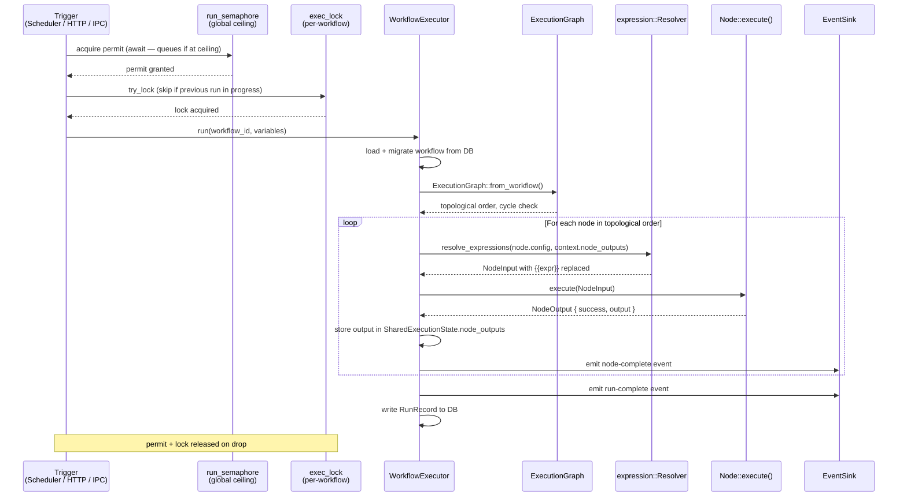

# Execution Flow — Internals

This document explains how Flowo turns a saved workflow JSON into a completed run, step by step. It is aimed at contributors and embedders, not end users.

---

## Overview



Every execution is driven by a single entry point: `WorkflowExecutor::run()` in `flowo-engine/src/executor/mod.rs`.

---

## 1. Trigger

A run begins from one of three sources:

| Source | Code path |
|---|---|
| Scheduler (interval / cron / once / webhook) | `scheduler/mod.rs` → `fire_once_with_vars()` |
| Server HTTP `/run` endpoint | `flowo-server/src/api_server/routes/workflows.rs` |
| Tauri IPC `run_workflow` command | `src-tauri/src/lib.rs` |

All three converge on `WorkflowExecutor::run()`. The trigger type is stored in the `ExecutionContext` metadata map.

---

## 2. Concurrent-run control

Before any executor is constructed, two guards are taken:

1. **Global semaphore** (`run_semaphore`) — limits the total number of simultaneous executions across all workflows. Default: 16 (server) and 16 (scheduler). Configurable with `--max-concurrent-runs`. Acquiring this semaphore queues the run rather than rejecting it (scheduler) or returns HTTP 429 (server).

2. **Per-workflow mutex** (`exec_lock` / `exec_locks`) — ensures only one instance of a given workflow runs at a time. If the lock cannot be taken, the run is skipped with a "previous run still in progress" log.

---

## 3. Workflow loading

The executor reads the workflow from the database (`WorkflowDb`), applies any pending schema migrations (`migration.rs`), then deserialises it into a `Workflow` struct (`model.rs`).

If `schema_version` differs from `CURRENT_VERSION` (defined in `migration.rs`), the migration chain runs upgrade functions in order until the workflow reaches the current schema.

---

## 4. Graph construction

`ExecutionGraph::from_workflow()` converts the flat `nodes` / `edges` list into a directed acyclic graph using `petgraph`. It validates:

- No cycles
- All edge references resolve to known node IDs
- At least one node with no incoming edges (trigger node)

If validation fails, the executor emits a `workflow-error` event and returns without running.

---

## 5. Expression resolution

Before a node executes, its `config` map is walked by the expression resolver (`expression/resolver.rs`). Expressions use the syntax `{{node_id.field.path}}` and resolve against:

- `input.context.node_outputs` — results of previously completed nodes
- `input.context.variables` — variables injected at run start (trigger payload, manual vars)

Resolution failures are logged at `Warn` level and do not stop execution — the unresolved template string is passed through unchanged.

---

## 6. Node execution

Nodes are run by one of two strategies, selected by `Workflow::parallel_execution`:

| Mode | Module | Behaviour |
|---|---|---|
| Sequential (default) | `executor/sequential.rs` | Topological sort, one node at a time |
| Parallel | `executor/parallel.rs` | Ready nodes (all parents done) run concurrently up to `max_concurrent_nodes` |

Each node receives a `NodeInput` and returns a `NodeOutput`. The executor writes the output into `SharedExecutionState.node_outputs` before advancing to successors.

The loop node (`executor/loop_executor.rs`) handles `loop_node` type specially: it iterates over an array in the node output and re-runs its subgraph for each element.

---

## 7. Error handling

`NodeOutput` carries a `success: bool` and an optional `NodeError { code, message, recoverable }`.

- `recoverable: true` — the executor applies the node's retry policy (`max_attempts`, `backoff_ms`), then routes to `fallback_node` if configured.
- `recoverable: false` — the executor short-circuits immediately, recording the failure in `SharedExecutionState`.

The maximum total execution time is bounded by `server_max_duration_secs` (server flag `--max-duration`). A `CancellationToken` propagates the deadline through async tasks.

---

## 8. Events

Throughout execution the executor calls `EventSink::emit(event, payload)`. In the Tauri app, the event sink is a thin wrapper over `tauri::AppHandle::emit_all`. In the server, it writes to an SSE stream.

Key events:

| Event | When |
|---|---|
| `workflow-started` | Immediately before node execution begins |
| `node-started` | Before each node execute() call |
| `node-completed` | After each successful node |
| `node-failed` | After a non-recoverable node failure |
| `workflow-completed` | After the last node succeeds |
| `workflow-failed` | After a fatal failure |
| `scheduler-status` | On scheduler state changes (waiting / running / error / done) |

---

## 9. Result recording

On completion, the executor writes a `RunRecord` to `WorkflowDb` (SQLite). The record includes: execution ID, workflow ID, start time, duration, success flag, and the full `node_outputs` map serialised as JSON.

In the Tauri app, the last N records are also mirrored to `localStorage` via `run-history.ts` for instant panel display on reload.

---

## 10. Credential resolution

Nodes that require credentials receive them via `CredentialResolver::resolve(credential_id)`. In the Tauri app this reads from the encrypted `CredentialStore` (keychain-backed). In the server it reads from environment variables via `EnvCredentialResolver`.

Credentials are never written to `node_outputs` or run records.

---

## Worked example: `http_request → transform`

This traces a two-node workflow through the full execution loop.

### Workflow definition (abbreviated)

```json
{
  "nodes": [
    { "id": "n1", "node_type_id": "http_request", "config": { "url": "https://api.example.com/users/1", "method": "GET" } },
    { "id": "n2", "node_type_id": "transform_data", "config": { "code": "return { name: input.body.name.toUpperCase() };" } }
  ],
  "edges": [{ "id": "e1", "source": "n1", "target": "n2" }]
}
```

### Step 1 — n1 executes, output stored

`HttpRequestNode::execute()` returns:

```json
{
  "success": true,
  "output": {
    "status": 200,
    "body": { "id": 1, "name": "alice" },
    "headers": { "content-type": "application/json" }
  }
}
```

Executor writes this into `SharedExecutionState.node_outputs`:

```json
{
  "n1": { "status": 200, "body": { "id": 1, "name": "alice" }, "headers": { ... } }
}
```

### Step 2 — expression resolution for n2

Before n2 executes, `expression::Resolver` walks `n2.config` and resolves `{{expr}}` patterns against `context.node_outputs`.

Raw config (as stored):
```json
{ "code": "return { name: input.body.name.toUpperCase() };" }
```

n2's config has no `{{expr}}` expressions — it uses `input` (the runtime NodeInput), not cross-node references. No substitution needed. The resolved `NodeInput` passed to n2:

```json
{
  "node_id": "n2",
  "workflow_id": "wf_abc",
  "execution_id": "exec_xyz",
  "input": { "code": "return { name: input.body.name.toUpperCase() };" },
  "context": {
    "node_outputs": { "n1": { "status": 200, "body": { "id": 1, "name": "alice" } } },
    "variables": {},
    "metadata": {}
  }
}
```

**Expression reference example** — if n2's config were instead:

```json
{ "greeting": "Hello, {{n1.body.name}}!" }
```

The resolver would walk the config, find `{{n1.body.name}}`, look up `context.node_outputs["n1"]["body"]["name"]`, and produce:

```json
{ "greeting": "Hello, alice!" }
```

**Failed resolution** — if the path does not exist:

```json
{ "greeting": "Hello, {{n1.body.missing}}!" }
```

The resolver cannot find `missing` in n1's output. It substitutes `""` and (after the H1 fix) emits a `Warn`-level log entry:

```
[WARN] node=n2  Expression {{n1.body.missing}} could not be resolved — substituted empty string
```

Without the H1 fix this appeared at `Info`, making it invisible to anyone filtering the run log for warnings.
