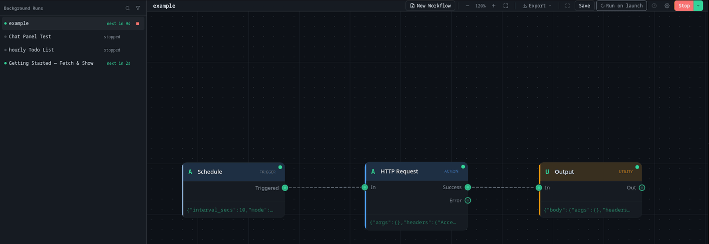

# Background Runs

Most of the workflows you'll actually keep around aren't meant to be run by hand every time. This page covers how to make one run on its own: on a timer, when an HTTP request comes in, or every time you open Aerini, and how to check on it afterward.

If you haven't read [Concepts](../getting-started/concepts.md) yet, do that first for what a trigger and a run are. This page also assumes you've seen the Schedule and Webhook entries in [Nodes Reference](nodes.md); it won't repeat their field-by-field settings, only what happens once one of them is running unattended.

## Two ways to run a workflow

Click the arrow next to the **Run** button and you'll see two options:

- **Run Now**: test immediately, results shown below. This runs the workflow once, right now, and shows the outcome live on the canvas and in the output drawer, the same as pressing plain **Run**.
- **Schedule Run**: run automatically via a Schedule, Webhook, or trigger-plugin trigger. This hands the workflow off to Aerini's background scheduler, which owns it from that point on, whether or not you're looking at it.

Only a workflow whose trigger is **Schedule**, **Webhook**, or a trigger plugin can use Schedule Run. Try it on a **Manual Trigger** workflow and Aerini stops you with a clear message instead: add a Schedule, Webhook, or trigger-plugin node first. A trigger plugin starts its own events only when the workflow runs in the background; **Run** executes it once as an ordinary step.

Run Now still has a special case worth knowing for each of those two triggers:

- On a **Webhook**-triggered workflow, plain Run binds the configured port and waits, up to the node's **Timeout** setting (60 seconds by default), for one real HTTP request. It runs once when that request arrives, then stops. It's the built-in way to test a webhook workflow with a real call, without touching the scheduler at all.
- On a **Schedule**-triggered workflow, plain Run ignores the interval, cron expression, or run-at time you configured and runs the rest of the workflow immediately. The schedule itself only takes effect once you use Schedule Run.

## Turning a workflow into a background run

Click **Schedule Run**. If the workflow doesn't have a name yet, Aerini asks for one first, then saves it: the scheduler reads workflows from what's saved on disk, not from whatever's open on your canvas, so this save has to happen before it can take over.

From here, Aerini owns the loop. You can close the workflow, open a different one, or switch to another app entirely, and it keeps firing on schedule.

## How Schedule behaves in the background

Once handed to the scheduler, a Schedule trigger's three modes behave like this:

- **Interval**: waits the configured number of seconds, fires, waits again, forever. The 10-second floor is enforced by the engine itself, not just the field in the app, so there's no way to get a tighter loop than that even by editing the workflow file directly.
- **Cron**: works out the next time your expression matches, waits until then, fires, and repeats.
- **Once**: waits until the configured time, fires exactly once, then marks itself done and doesn't fire again. If that time has already passed by the moment you click Schedule Run, it fires right away instead of failing, with a warning that the original time was missed.

## How Webhook behaves in the background

A background Webhook trigger works differently from Schedule: instead of waiting for a fixed point in time, it binds its configured port and path and sits there listening. The moment a request arrives, it fires the workflow and immediately starts listening again for the next one. There's no "waiting until the next scheduled time," only "waiting for the next request."

Two workflows can't claim the same port at once. If you try, Aerini tells you which workflow already has it rather than failing with a raw connection error.

Everything about the port, path, secret, and dedup window is the same as the field-level detail already covered in [Nodes Reference](nodes.md#webhook), including the reminder that the webhook only ever binds to `127.0.0.1`. Reaching it from outside your machine, in server mode or otherwise, needs a reverse proxy in front of it.

## How trigger plugins behave in the background

A trigger plugin runs its own event source: Aerini keeps one instance of the plugin alive and starts a run each time it emits an event. Like Webhook, it has no fixed schedule, so by default the Background Runs panel shows it as "running". A plugin that reports when its next event is due shows a countdown instead, and the countdown is cleared when you stop the workflow or the plugin restarts. The countdown is only a display: runs start when the plugin emits an event, not when the countdown reaches zero. If the time passes without a new report, the panel shows "running…" until the plugin reports again. Plugin authors can add this; see [Showing a countdown to the next event](../development/plugin-authoring.md#showing-a-countdown-to-the-next-event).

## Skipped runs, not queued runs

If a Schedule, Webhook, or trigger-plugin fire lands while the same workflow's previous run is still going, the new one is skipped rather than queued behind it, and you'll see it as a toast: "run skipped, previous run still in progress." For Webhook specifically, a duplicate delivery inside the node's configured dedup window is skipped the same way. Either way, the caller that sent the request still gets its normal response.

In practice this means a workflow that takes longer than its own interval just runs less often than configured. It never piles up a backlog of runs waiting to fire.

## Run on launch

Next to Save is a toggle button labeled **Run on launch**. It only appears on a workflow with a Schedule, Webhook, or trigger-plugin trigger; on anything else it's hidden, with a tooltip explaining why.

Turning it on does the same save-and-hand-off as Schedule Run, but also marks the workflow to start automatically every time you open Aerini, without you clicking Schedule Run again. On a fresh app launch it doesn't fire an extra run right away: an Interval or Cron job works out its next occurrence from the current time and waits for that, the same as if you'd just started it by hand.

Two things about this toggle that aren't obvious from the button alone:

- **Stopping a run doesn't turn this off.** If you stop a Run on launch workflow from the Background Runs panel, that only stops it for the rest of this session. Run on launch itself is untouched, and it starts the workflow again the next time you open Aerini. To stop it permanently, open the workflow and click Run on launch again to switch it off.
- **Turning it off doesn't stop a run that's already going.** The toggle only changes what happens at your next launch. If the workflow is currently running, use Stop (from the Run menu or the Background Runs panel) to stop it right now.

Run on launch is meant for Interval, Cron, and Webhook triggers, which repeat indefinitely. Pairing it with a Once-mode Schedule is unlikely to do what you want: since a Once trigger's target time doesn't move, turning this on for a Once workflow whose time has already passed will fire it again on every single app launch from then on.

## The Background Runs panel

Click **Background Runs** in the sidebar to see every workflow currently or recently running in the background: name, a status dot, and either a countdown to its next run ("next in Ns") or, for a running job with no known next time such as a Webhook or most trigger plugins, "running", or how long its last run took.

From here you can stop a job that's currently running. Anything that isn't running (stopped, done, or failed) instead shows two actions: restart it, or dismiss it from the list. Clicking a job opens that workflow and jumps straight to its **History** tab.

## Editing a workflow while it runs

Edits to a running workflow are saved automatically about half a second after you make them. The next run reads the saved workflow, so rewiring nodes or changing a node's settings takes effect on the next run without a restart. A run that is already in progress finishes with the version it started with.

The trigger is the exception. Schedule timing (interval, cron, or run-at time), a Webhook's port, path, method, secret and dedup window, a trigger plugin's settings, and the trigger node's type are fixed when the job starts. After you change one, the status bar shows **Restart to apply trigger**, and the [Chat panel](chat-panel.md) offers a **Restart** button. Otherwise stop the job and start it again. Stopping ends any run in progress, so the Chat panel asks first when one is running.

The app notices a trigger change by comparing the canvas with the saved workflow as it was when the app first saw the job running. If you open Aerini while a job is already running, that comparison starts from the workflow saved at that moment. If autosave fails, the status bar shows **Not saved**, because the running job can only see saved edits; press `Ctrl+S` to retry.

## Run history

Every run gets recorded, whether it started from Run Now, Schedule Run, Run on launch, or a live webhook request. There's no separate "background run log": open a workflow's output drawer and click its **History** tab to see all of them together, newest first, filterable to just successes or failures.

Each entry records whether it succeeded, how long it took, and the full result, including every node's output and logs, the same detail you'd see from watching it run live. Aerini keeps the last 500 runs per workflow and quietly drops the oldest ones past that; there's currently no setting to change that number.

Two extra things worth knowing:

- **Replay** reruns a past entry using that exact run's recorded trigger data (the payload a Webhook received, or the timestamp a Schedule fired at), so you can test against a real historical case without waiting for it to happen again. Everything downstream of the trigger still executes live against today's workflow, so the result can differ if you've edited anything since.
- A run that never finished, because Aerini was force-quit or crashed mid-execution, shows up as **Interrupted** rather than a pass or fail, and can't be replayed since it has no recorded output.

## Unattended execution and dangerous nodes

A manual Run on a workflow containing Shell Command, Code, or Database shows a confirmation dialog before it executes. A scheduled or webhook-triggered background fire skips that dialog entirely; it only logs a warning. If a workflow with one of those nodes is set to run unattended, it will keep executing that node unattended, on every single fire, with nobody watching to catch a problem before it happens. See [Security](security.md) for the full model around these nodes and what else it's worth locking down before exposing a webhook to the outside world.

## Stopping background runs for good

Closing Aerini's window doesn't stop anything running in the background. The window just hides; Aerini keeps running from your system tray, and any active schedule or webhook listener keeps going with it.

To actually stop everything, either turn off Run on launch and Stop each background job individually, or quit Aerini entirely from the tray icon's menu (**Quit Aerini**), which stops every background run cleanly before the app closes.

## Beyond the desktop app

Everything on this page (the scheduler, the Background Runs panel, Run on launch, the tray icon) runs inside the desktop app's own process. If your computer is off, or Aerini isn't running at all, nothing here fires: there's no cloud sitting behind it to pick up the slack.

To keep a workflow running without the desktop app open, export it with **Export for Server** from the toolbar's Export menu. That packages the workflow into a self-contained deployment for `aerini-server`, a separate binary that runs its own independent copy of the same Schedule or Webhook trigger, with its own separate run history, and no desktop UI at all. Setting that up is covered in [Server Deployment](../operations/server-deploy.md).

## See also

- [Concepts](../getting-started/concepts.md), for what a trigger, a run, and run history are
- [Nodes reference](nodes.md), for every Schedule and Webhook field
- [Credentials](credentials.md), for storing keys a background workflow needs
- [Security](security.md), for the full model around dangerous nodes and exposing a webhook publicly
- [Server Deployment](../operations/server-deploy.md), for running a workflow with no desktop app involved at all
