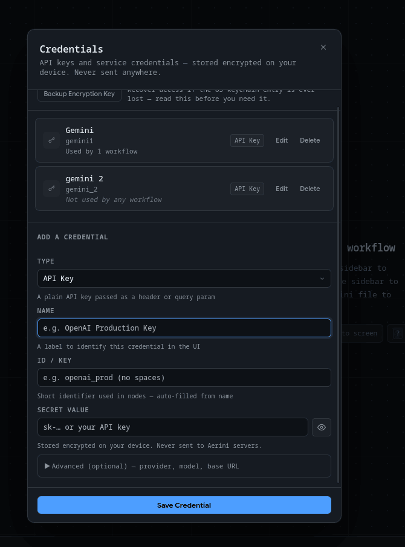
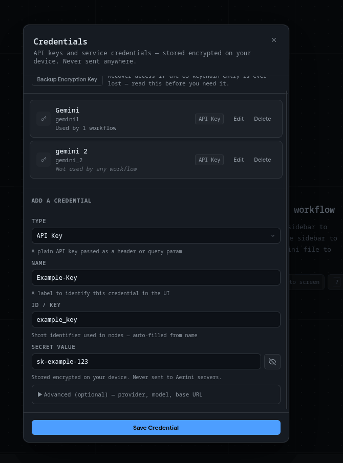

# Credentials

Most useful workflows talk to something outside Aerini: Slack, GitHub, an AI provider, your own SMTP server. That means API keys and tokens. This page covers where those live, how to add one, and how each node actually gets hold of it.

If you haven't read [Concepts](../getting-started/concepts.md) yet, do that first. It defines "node" and "workflow," which this page assumes you already know.

## What a credential is

A credential is one saved secret (a key, token, or password) that you can reuse across any node in any workflow instead of retyping it every time. Aerini encrypts every credential with AES-256-GCM before writing it to disk, and the encryption key itself lives in your operating system's credential manager (Keychain on macOS, Credential Manager on Windows, Secret Service on Linux), not in a plain file next to your workflows. Nothing you save here is sent anywhere. Aerini has no servers and no account system to send it to.

That's the desktop app. Running unattended on a server is different, covered near the bottom of this page.

## Opening Credentials

Click **Credentials** in the toolbar. This opens a panel listing everything you've saved, each with a name, a type, and a note showing whether any workflow currently uses it.

## Adding a credential

Click **Add a credential** (or, if this is your first one, **Add your first credential**) at the bottom of the panel and fill in:

- **Type**: pick the shape of the secret. This mostly helps you and other people reading your credential list remember what it's for:
  - **API Key**: a plain key sent as a header or query parameter
  - **Bearer Token**: sent as `Authorization: Bearer <value>`
  - **Basic Auth**: enter as `username:password`
  - **OAuth Token**: an OAuth access or refresh token
  - **Other / Custom**: anything else
- **Name**: a label for your own reference, like "OpenAI Production Key."
- **ID**: a short identifier used internally to attach this credential to a node. It's auto-filled from the name (lowercased, spaces turned into underscores) but you can edit it before saving. Letters, numbers, underscores, and hyphens only. You can't change it later, so if you need a different ID, delete the credential and add it again.
- **Secret Value**: the actual key or token. Click the eye icon to reveal it while typing. Required for every Advanced Provider value except one: if Advanced Provider (below) is set to `local`, this field is optional — see [Local Models](local-models.md#reusing-this-setup-with-a-saved-credential).

An **Advanced** section lets you optionally record a provider, model, and base URL alongside the secret. These aren't secret themselves, they exist so that when you later pick this credential on an AI node, Aerini can fill in matching fields for you automatically. Next to Model, a **Fetch Models** button queries that provider's `/models` endpoint using whatever Provider, Base URL, and Secret Value are currently in this form, and offers a dropdown of what it finds — typing a name directly always still works if the fetch fails. More on that below.

Click **Save Credential**. That's it: the credential now shows up in the panel and is available to every workflow.

## Viewing, editing, and deleting

Click **Edit** on any saved credential to see its secret value again (still masked behind the eye icon) and change it. The name and secret can be edited; the ID can't.

Click **Delete** to remove one. If any workflow still references it, Aerini refuses and tells you which workflow(s) are using it, so you won't accidentally break a node without knowing why. Delete or reassign the credential on those nodes first, then delete it.

## Using a credential in a node

Open a node's settings and look for a **Connection** section. If the node has one, it shows a **Use Saved Credential** dropdown listing every credential you've saved, filtered by type only if that specific field requires one (most don't, so you'll usually see your full list) — except on AI Prompt, AI Agent, and Image Generation, which filter differently; see [AI nodes: auto-fill and one-off keys](#ai-nodes-auto-fill-and-one-off-keys) below. Pick one and the node uses it at run time. The secret itself is never written into the workflow file; only the credential's ID is, and that ID is resolved back to the real value the moment the workflow runs.

Here's the part that trips people up: **not every field described as "resolved from Connections" actually gets a dropdown.** Only a field literally named `api_key` or `password` gets the automatic picker. Everything else on a node, however it's labeled, is a plain text box you type into directly, and whatever you type is saved in the workflow file unencrypted. This is a real gap between how a few node descriptions read and how the picker currently works, not something you're doing wrong.

Here's how it breaks down across the nodes people connect credentials to most:

| Node | Credential field(s) | How you fill it in |
|---|---|---|
| Slack | `api_key` (Bot Token) | Saved Credential dropdown |
| GitHub | `api_key` (personal access token) | Saved Credential dropdown |
| Notion | `api_key` (integration token) | Saved Credential dropdown |
| Telegram | `api_key` (Bot Token) | Saved Credential dropdown |
| SendGrid | `api_key` | Saved Credential dropdown |
| Stripe | `api_key` (secret key) | Saved Credential dropdown |
| Send Email | `password` (paired with a plain `username` field) | Saved Credential dropdown |
| AI Prompt, AI Agent, Image Generation | `api_key` | Saved Credential dropdown, plus a one-off unencrypted option (see below) |
| HTTP Request | `api_key` | Saved Credential dropdown, combined with an **Auth Mode** setting (see below) |
| Discord | `webhook_url` | Typed directly into the node, no credential store involved |
| S3 Storage | `access_key_id`, `secret_access_key` | Typed directly into the node fields |
| Google Sheets | `api_key` (raw access token), or `client_id` + `client_secret` (OAuth app) | `api_key` via dropdown; `client_id`/`client_secret` typed directly |
| Social Upload | `client_id`, `client_secret` | Typed directly into the node fields |

For Discord, S3, and the OAuth app fields on Google Sheets and Social Upload, there's nothing wrong with typing the value straight into the node. It's just worth knowing it isn't encrypted the way a saved credential is, since it lives in the workflow's `.aerini`/`.json` file in plain text.

### HTTP Request's Auth Mode

The HTTP Request node's Connection section includes an **Auth Mode** selector that controls how your saved credential's value gets attached to the request:

- **Bearer Token**: `Authorization: Bearer <value>` (the default)
- **API Key Header**: sent under a header name you choose (defaults to `X-API-Key`)
- **Basic Auth**: base64-encoded. If your saved value already contains a colon (`user:pass`), it's used as-is; otherwise it's sent with an empty username, as `:<value>`.
- **None**: the credential is ignored and no `Authorization` header is added

Pick whichever one matches the API you're calling. If you're not sure, check that API's own documentation.

### AI nodes: auto-fill and one-off keys

AI Prompt, AI Agent, and Image Generation all read a `provider`, `model`, and `base_url` alongside `api_key`. When you pick a saved credential that has Advanced metadata filled in (see [Adding a credential](#adding-a-credential) above), Aerini copies that provider, model, and base URL into the node automatically, but only into fields that are still blank. It never overwrites something you already typed.

On these three node types, the **Use Saved Credential** dropdown is also filtered to match: it only lists credentials whose Advanced Provider is the same as the Provider currently selected on the node, plus any credential with no Provider set at all (those are always shown, since Advanced metadata is optional). While the node's Provider is `auto`, nothing is filtered, because the provider isn't decided until the node runs. Each matched credential shows its provider next to its name, e.g. "My Key — Anthropic", so you can tell them apart at a glance. If nothing matches, the dropdown is empty and the warning below it names the provider it's short a credential for — use **Or enter a key directly** below, or add a matching credential from the Credentials panel. Changing the node's Provider re-filters the list immediately.

These three node types also offer **Or enter a key directly**, an inline field for a one-off API key. It's stored in the workflow file unencrypted and is ignored the moment you pick a saved credential instead. Use it for quick testing, not for anything you'd mind someone else seeing if they opened the workflow file.

Running a local model instead of a hosted API (Ollama and similar) is covered in [Local Models](local-models.md). For now, `base_url` on these nodes accepts loopback and private-network addresses, which a hosted API's base URL normally can't.

## OAuth

Four integrations use real OAuth 2.0 instead of a pasted key: **YouTube**, **Instagram**, and **TikTok** (all through the Social Upload node), plus **Google Sheets**. Aerini runs the whole exchange itself: it opens your browser to the provider's login page, listens on `http://127.0.0.1:42069/callback` for the response, and stores the resulting tokens in your OS keychain, refreshing them automatically before they expire.

The sign-in waits 60 seconds for the response and ignores anything else that reaches that port (a stray request, or one with the wrong `state`), so it only ends on your login, a refusal (reported with the provider's reason), or the timeout. Two workflows that need the same login at once share a single sign-in. A refresh that fails for a passing reason (network error, provider outage, rate limit) keeps your stored tokens and fails that run with a retryable error; only a provider rejecting the stored credential (for example a revoked grant) discards it and starts a new sign-in. If the keychain refuses to save tokens (common on a headless Linux box), the run still works, a warning is logged, and the next run signs in again. Signing in needs a desktop and a browser on the machine running the workflow, so on a headless server sign in on the desktop app first.

### YouTube, Instagram, TikTok

On a Social Upload node, open its **Platform Setup** section and click **Open Setup Guide**. It walks through each platform's developer console step by step: which product to enable, where to find your Client ID and Client Secret, and the exact redirect URI to register (it reads the live port Aerini will actually use, and warns you if 42069 is already taken by something else on your machine). A few things worth knowing going in:

- **Instagram** requires your media to already be hosted at a public URL. Social Upload can't hand it a local file directly: upload to a CDN or web host first, and put that `http(s)` URL in the file's `data` field.
- **TikTok** apps start in sandbox mode: posts are private and visible only to your own account until the app passes review.
- **YouTube** apps start in Google's "Testing" status, capped at whatever test users you've added, until you submit for verification.

Once you have a Client ID and Client Secret, paste them directly into the node's **Client ID** and **Client Secret** fields. These aren't saved-credential fields (see the table above), so there's no dropdown step. Type them in, and Aerini handles the OAuth flow the first time the node runs.

### Google Sheets

Google Sheets doesn't have its own setup guide button, but it uses the same OAuth machinery as YouTube. In the Google Cloud Console, enable the **Google Sheets API** instead of YouTube Data API, and request the `https://www.googleapis.com/auth/spreadsheets` scope instead of a YouTube upload scope. Everything else, the OAuth consent screen, the redirect URI (the same `127.0.0.1:42069/callback`), creating a Desktop app OAuth client, works the same way the YouTube steps in the Setup Guide describe.

You have two options on the node itself:

- **`client_id` + `client_secret`** (recommended): Aerini stores and refreshes the token automatically, so you authorize once.
- **`api_key`**, a raw access token pasted straight in: quicker to set up, but it expires after about an hour with no automatic refresh, so you'd be replacing it constantly. Use this only for a quick one-off test.

If you set `client_id`, also set `client_secret`, and vice versa. Setting only one is treated as a mistake and the node will tell you so rather than silently falling back to the `api_key` field.

## Running headless: `aerini-server` and environment variables

Everything above describes the desktop app. If you export a workflow to run unattended with `aerini-server`, credentials work differently: the server doesn't read your encrypted credential store at all. Instead, it reads environment variables.

Each credential ID maps to a variable named `AERINI_CRED_<ID>`, with the ID uppercased and anything that isn't a letter or digit turned into an underscore. A credential with ID `openai-prod` becomes `AERINI_CRED_OPENAI_PROD`. If a required variable isn't set when the server starts, it fails immediately with the exact variable name it's missing, rather than running with a silently broken node.

You don't have to work out these names by hand. When you export a workflow for server deployment, Aerini scans it for every node that uses a saved credential and generates the matching environment variable names for you, along with a `.env.example` file listing exactly what to set before you start the server.

One catch, worth repeating from earlier: this scan only catches fields wired to a saved credential (the "Saved Credential dropdown" rows in the table above). A Discord webhook URL, S3 keys, or a Google Sheets/Social Upload `client_id`/`client_secret` you typed directly aren't saved credentials, so they aren't converted to environment variables either. They're exported straight into the workflow JSON as plain text, along with everything else in it. Treat an exported package containing those fields as sensitive, the same as you'd treat the original workflow file.

Full deployment steps (starting the server, the status page, ports, and the rest) are covered in [Deploying aerini-server](../operations/server-deploy.md).

## Backing up your encryption key

Every credential is encrypted with one AES-256 key, normally stored in your OS keychain. If that keychain entry is ever lost (OS reset, migrating to a new machine, a Linux setup with no keychain running), there's no way to decrypt your saved credentials again, unless you've backed up the key yourself beforehand.

In the Credentials panel, click **Backup Encryption Key**. Aerini asks you to confirm, since anyone holding this value can decrypt everything in your credential store, then shows it once. Copy it into a password manager, not a plain text file on the same machine. If you ever do lose the keychain entry, restoring from this backup is what lets Aerini decrypt your existing credentials again instead of starting from a blank store.

### If Aerini can't read the key

When credentials are saved and Aerini can't get the key (you clicked **Deny** on the macOS Keychain prompt, the keychain is locked, or its entry is gone), Aerini shows an error and closes instead of starting. It never creates a replacement key while saved credentials exist, because a new key can't decrypt them, and new credentials would then be encrypted with a different key than the old ones. Nothing is deleted or changed.

- **macOS, access denied or prompt dismissed:** open Aerini again and choose **Always Allow** when macOS asks for Keychain access.
- **Keychain locked or not running:** unlock or start it, then open Aerini again.
- **Keychain entry lost:** save the key from your backup, exactly as it was shown, into a file named `.cred.key` in Aerini's [data folder](../getting-started/installation.md#uninstalling), then open Aerini. It moves the key back into the keychain and deletes the file.

A fresh install, or a store with no saved credentials, isn't affected: Aerini creates its key the first time it runs.

## See also

- [Concepts](../getting-started/concepts.md), for what a node and a workflow are
- [Nodes reference](nodes.md), for every field on every built-in node
- [Expressions](expressions.md), for wiring one node's output into another
- [Security](security.md), for the full encryption and key-recovery model
