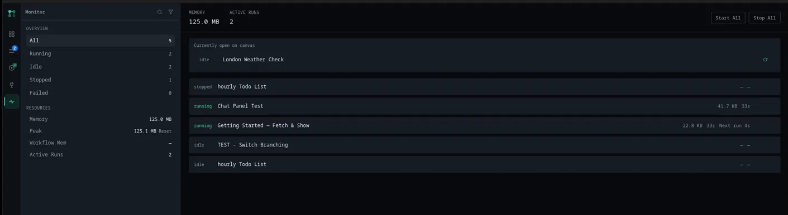

# Monitor

The Monitor panel is where you check on every workflow at once instead of opening them one at a time: what's running right now, how much memory it's using, and a couple of controls for starting or stopping everything in bulk. This page covers reading it and using those controls.

If you haven't read [Background Runs](background-runs.md) yet, read that first. Monitor is a dashboard over the same scheduler that page describes; it doesn't introduce a different way of running things, just a different view of it.

## Opening Monitor

Click **Monitor** in the sidebar. It updates on its own roughly once a second while open; you don't need to refresh anything.

## The workflow list

Every workflow you have, whether it's idle, currently running, or was scheduled and has since stopped, gets a row: status, name, memory (while running), and either how long the current run has taken or a countdown to its next scheduled fire. A Webhook or trigger-plugin workflow that is armed and waiting for a request or event shows **Listening** instead of a time that counts up from when it was armed; a plugin that reports when its next event is due keeps a countdown. Hovering a row shows its available actions, which depend on its status:

- **Running**: a stop button.
- **Idle**: a start button that runs it in the background the same way **Schedule Run** does from the toolbar.
- Anything else (stopped, failed, done): a restart button.

Every row also has an **open** action that jumps straight to that workflow on the canvas, exiting Monitor.

A workflow you currently have open on the canvas gets its own card above the main list, so you don't have to hunt for it in an otherwise-alphabetical or status-sorted rundown.

## Start All and Stop All

Two buttons in the header, each shown only when there's something for it to do:

- **Start All** starts every workflow that's currently idle, stopped, or failed and has a Schedule, Webhook, or trigger-plugin trigger to start from. Same eligibility as pressing start on each one individually, just batched.
- **Stop All** stops every workflow currently running.

If a workflow's configured port turns out to be taken by something else, Start (individually or via Start All) automatically retries on the next port up rather than just failing, and tells you it did so.

## Filtering the list

Two icons in the Monitor tab's header: a search icon that opens a **Filter workflows…** box (matches by name), and a filter icon with a dropdown of statuses (All, Running, Success, Failed, Stopped, Idle, Scheduled) to narrow the list to just one. **Scheduled** lists every workflow running in the background with a Schedule, Webhook, or trigger-plugin trigger, including Webhook and plugin triggers that have no next fire time, plus any workflow with Run on launch turned on. A workflow that was stopped doesn't keep its old countdown when you start it again.

## The sidebar

Two sections, always visible alongside the list:

- **Overview** breaks every workflow down by status (All, Running, Idle, Stopped, Failed) with a count next to each. Click one to apply that as the list's filter, the same effect as the filter icon above.
- **Resources** shows the app's current process memory, the peak process memory recorded since you last reset it (a **Reset** link next to it clears that peak, this session only, not a lasting setting), the combined memory of workflows currently running, and how many runs are active right now.

## See also

- [Background Runs](background-runs.md), for what "running in the background" actually means and how schedules and webhooks behave once handed off to the scheduler
- [Concepts](../getting-started/concepts.md), for what a run is
- [Troubleshooting](../troubleshooting.md), if a workflow shown here isn't behaving the way you expect
