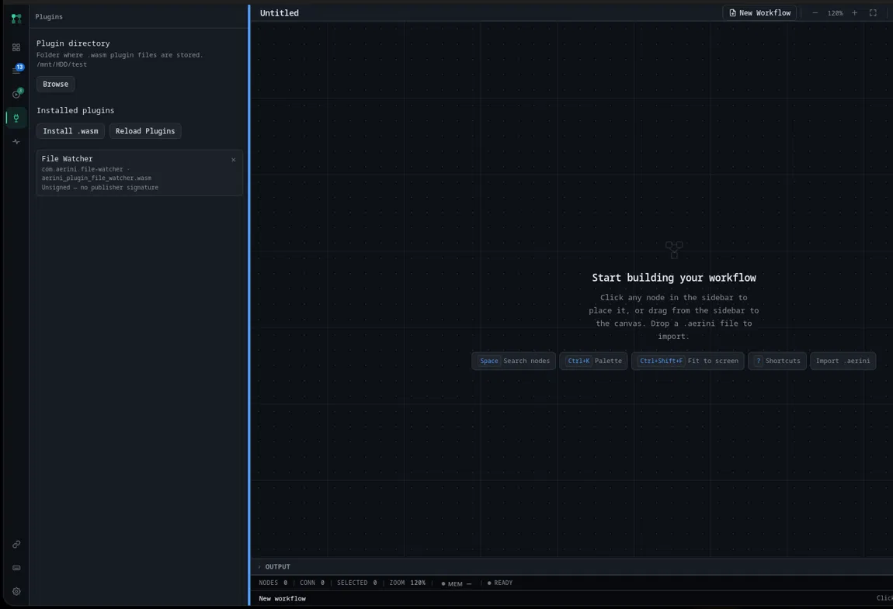

# Plugins

A [plugin](../glossary.md#plugin) is a node type someone else built and shipped as a single file, install it and it shows up in your node picker right next to the built-ins. This page covers installing, updating, and removing one as a user. Writing your own is a different page: see [Plugin Authoring](../development/plugin-authoring.md).

If you haven't read [Concepts](../getting-started/concepts.md) yet, do that first for what a node is.

## Opening Plugins

Click **Plugins** in the sidebar. It's its own panel, not tucked inside Settings.

## Setting a plugin directory

Before you can install anything, Aerini needs a folder to keep plugin files in. Click **Browse** next to **Plugin directory** and pick or create one. This is a one-time setup step; every plugin you install afterward lives in this same folder, and both **Install .wasm** and drag-and-drop install (below) stay disabled until it's set.

## Installing a plugin

Two ways to install a `.wasm` file (a single node) or an `.aerinipkg` file (a bundle of more than one node, distributed together):

- Click **Install .wasm** and pick the file from the dialog that opens.
- Drag the file straight onto the Aerini window. Aerini asks you to confirm ("Install plugin \"...\"? Only install plugins from sources you trust.") before installing it, the same caution you'd want before running anyone else's code.

Either way, Aerini installs the file into your plugin directory and reloads the node registry immediately, so the new node is available on the canvas without restarting the app. If installing over an existing plugin with the same identity, Aerini recognizes that and asks whether you want to update it rather than silently overwriting or refusing.

An `.aerinipkg` installs as a group: its member nodes appear together under one heading in the installed list, with a single **Remove pack** action instead of removing each node individually.

## The installed plugins list

Every installed plugin shows its display name, its type ID and filename, and (for a multi-node pack) which pack it belongs to. Two more things show up when relevant:

- **A load error**, in place of the type ID/filename line, if Aerini couldn't actually load the file, an incompatible version, corrupt file, or similar.
- **A signature status.** Publishers can optionally sign a plugin. **Unsigned** is the common, expected case for most community plugins and isn't itself a warning sign. Anything else, verified, unrecognized, or a mismatch, is worth reading; see [Security §The plugin (.wasm) sandbox boundary](security.md#the-plugin-wasm-sandbox-boundary) for exactly what a signature does and doesn't guarantee today.

## Reloading and restarting

Aerini rebuilds the node registry automatically after an install, update, or removal. If a folder's contents change from outside the app (you copied a file into the plugin directory by hand, say) and the picker doesn't pick it up, click **Reload Plugins** to force a rebuild. If a reload ever fails on its own, Aerini shows a banner asking you to restart the app to apply the change, a fallback path, not the normal one.

## Removing a plugin

Click the **×** next to a standalone plugin, or **Remove pack** on a pack's header to remove every node in it at once. Either takes effect immediately, same as an install.

## What sandboxing a plugin actually means

Every plugin call runs in its own fresh sandbox: no filesystem access at all, a capped memory ceiling, and outbound HTTP filtered by the same rules built-in nodes follow. A plugin node is flagged as a dangerous node in the UI, the same category as Shell Command, Code, and Database, and shows the same confirmation before it runs. That's a summary; the exact limits, what the sandbox doesn't protect against, and what a verified signature does and doesn't mean are covered in full in [Security](security.md#the-plugin-wasm-sandbox-boundary).

## See also

- [Plugin Authoring](../development/plugin-authoring.md), for writing and distributing your own plugin
- [Security](security.md#the-plugin-wasm-sandbox-boundary), for the full sandbox model and signature verification
- [Nodes Reference](nodes.md), for how a plugin node looks once it's on the canvas
