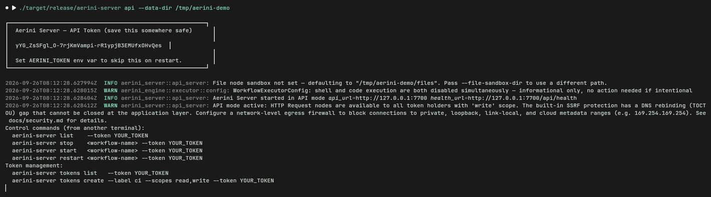
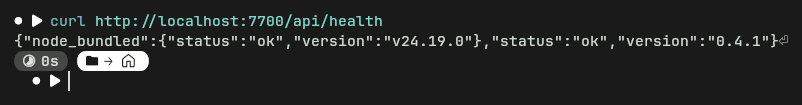
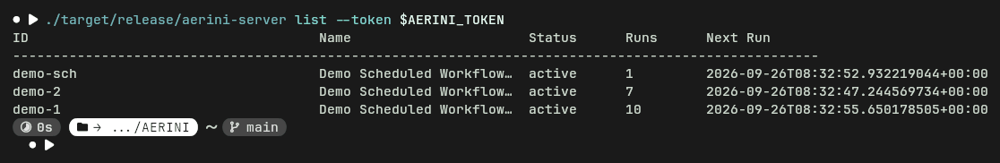
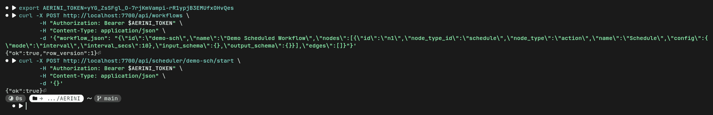

# Server Deployment

`aerini-server` is the headless binary that runs Aerini without the desktop app. It has two modes: `serve`, which runs one workflow exported from the desktop app, and `api`, which runs a full multi-workflow REST server. This page covers getting either one running, on Docker or on a bare-metal Linux box. For the security model behind the flags used here (SSRF protection, dangerous-node gating, credential encryption), see [Security §Hardening a server deployment](../guide/security.md#hardening-a-server-deployment); that page explains the *why*, this one covers the *how*. An exhaustive flag and REST route reference lives in [Server CLI Reference](server-cli-reference.md) and [Server API Reference](server-api-reference.md); this page sticks to what you need to get a deployment running and keep it running.

## Choosing a mode

Export a single workflow from the desktop app (**Export → Export for Server**, covered in [Background Runs §Beyond the desktop app](../guide/background-runs.md#beyond-the-desktop-app)) and you get `serve` mode: one workflow, its own run history, a status page, no other configuration to manage. This is the right choice if you have one or two workflows and want the least amount of moving parts.

`api` mode runs many workflows behind a real REST API with bearer-token auth, its own encrypted credential store, and scoped tokens (`read`/`write`/`admin`). It has no desktop-generated export package. You run it directly and create workflows through the API (or a future admin UI). Choose this if you're running more than a handful of workflows on one box, or you need another program to create and manage workflows programmatically.

Both modes bind `127.0.0.1` by default, disable Shell Command, Code (JS), and Database nodes until you explicitly pass `--allow-shell` / `--allow-code` / `--allow-database`, and print a warning if you widen either of those defaults without acknowledging the tradeoff. None of that is repeated here; see the security page linked above.

### The Export for Server panel

With a workflow open on the canvas, **Export → Export for Server** opens a panel that generates the `serve`-mode package `serve` mode itself runs (below). It shows:


- **Trigger**: what the exported package will start on, read straight from the workflow, for example `Webhook on :3456/webhook` or a schedule's interval.
- **🖥 Linux Server / 🐳 Docker tabs**: which package format to generate, not which server mode. Both tabs still export the same single-workflow `serve` mode described throughout this page; the Docker tab's output is the self-contained image covered in [§The desktop's "Export for Server → Docker" package](#the-desktop-s-export-for-server-→-docker-package) below, a different thing from `api` mode's own `docker-compose.yml`.
- **Credentials**: one row per credential the workflow actually references, a ✓ or ⚠ showing whether it's currently filled in on the desktop app, the environment variable name it'll export as, and which node uses it. Only names are ever written into the package; you set the real values as environment variables on the server yourself. If the workflow also uses a `{{$vars.x}}` variable, a **Required variables** table above this one lists each one's suggested environment key the same way.
- **Status page port**: the port the exported package's status page listens on, `7700` by default, must be between `1024` and `65535`. On the Docker tab this maps that port on the host; the container always listens on `7700` internally regardless of what you set here.

Click **Generate Linux Package** or **Generate Docker Package**, choose where to save the zip, and the panel tells you the exact next command to run (`./install.sh`, or `docker compose up --build -d`). The steps below pick up from there.

## Getting the `aerini-server` binary

As of Aerini 0.4.0, no prebuilt `aerini-server` binary is published anywhere. The [Releases page](https://github.com/Panchak2d/aerini/releases) only publishes desktop app installers (`.dmg`, `.msi`, `.exe`, `.deb`, `.AppImage`), not a standalone server binary. `install.sh`, generated by Export for Server, checks for `aerini-server` in its own folder and points you at that same Releases page if it's missing, but that page won't have it either. Until that changes, use one of the two paths below, both of which produce a real binary today: the official Docker image, or building from source.

## Docker (recommended)

The repository ships an official `Dockerfile` and `docker-compose.yml` at its root. This image is self-contained: the build stage compiles `aerini-server` as a static musl binary and fetches a matching Node.js runtime for Code (JS) nodes, and the runtime image ships both side by side, so nothing needs installing on the host.

```bash
git clone https://github.com/Panchak2d/aerini
cd aerini
cp .env.example .env   # set AERINI_TOKEN
docker compose up -d
```

`docker-compose.yml` requires `AERINI_TOKEN` to be set (it fails fast with a clear error if you skip this) and publishes the port as `127.0.0.1:7700:7700`, host-loopback only. The image defaults to `api` mode and answers its health check on `GET /api/health`. Widen `127.0.0.1:7700` to `0.0.0.0:7700` in `docker-compose.yml` only once you've read the SSRF and `--trusted-proxy-count` guidance in [Security](../guide/security.md#hardening-a-server-deployment), and put a reverse proxy with TLS in front rather than exposing this port directly.

### Running `serve` mode in the official image

The image's `ENTRYPOINT` is `aerini-server` itself; only the default `CMD` (`api`) is Compose-specific. To run `serve` mode instead, mount your exported `aerini-server.json` into `/data` and override the command:

```yaml
services:
  aerini:
    build: .
    ports:
      - "127.0.0.1:7700:7700"
    volumes:
      - ./aerini-server.json:/data/aerini-server.json:ro
      - aerini_data:/data
    environment:
      RUST_LOG: info
    command: ["serve", "--config", "/data/aerini-server.json", "--bind", "0.0.0.0"]
    restart: unless-stopped

volumes:
  aerini_data:
```

`--bind 0.0.0.0` here is the container's internal listen address, not a host-facing exposure setting. Docker only forwards what the `ports:` mapping publishes; the actual boundary is still the `127.0.0.1:7700:7700` line above.

### The desktop's "Export for Server → Docker" package

The **Docker** tab in the Export for Server panel generates a different Dockerfile: one that `git clone`s the Aerini repository at build time and produces a plain `debian:bookworm-slim` image, rather than reusing the official one above. That generated image downloads and checksum-verifies the same pinned Node.js runtime the official image uses (from the cloned repository's own `NODE_VERSION` file) and places it next to `aerini-server` as `node-bundled`, which is the only place Aerini's Code node ever looks for it (it never searches `PATH`, and never did; see below). A workflow with a Code (JS) node runs the same way in this package as it does in the official image above, once `--allow-code` is set. Workflows without Code nodes are unaffected either way.

## Bare metal (Linux)

### Building `aerini-server` from source

`aerini-server` builds like any other crate in the workspace; you don't need Tauri's desktop dependencies (`webkit2gtk` and friends) to build it, only Rust and one system library:

```bash
git clone https://github.com/Panchak2d/aerini
cd aerini
sudo apt install -y libdbus-1-dev   # Debian/Ubuntu; needed for OS-keyring support
cargo build --release -p aerini-server
```

Rust 1.94.1+ is required to build `aerini-server`; building the desktop app needs 1.95+, as [Installation](../getting-started/installation.md#building-from-source) states. The compiled binary lands at `target/release/aerini-server`. This does not build or fetch a Node.js runtime; see the Code node section below if your workflow needs one.

### `serve` mode

Unzip the package from Export for Server (**Export → Export for Server → 🖥 Linux Server**) next to the binary you just built, then either run `./install.sh` (installs a systemd user service, handles `.env`, enables lingering so it survives logout) or run it directly:

```bash
./aerini-server serve --config aerini-server.json --port 7700
```

The status page, plain HTML at `/`, is public by default and shows workflow name, run count, last/next run. `POST /api/run` (manual trigger), `GET /api/logs`, and `GET /api/runs` all require the `run_secret` you set at export time, sent as `Authorization: Bearer <run_secret>`. If the workflow contains a File node, pass `--file-sandbox-dir` or File nodes can read and write anywhere the server process can reach; if it contains Shell Command, Code, or Database nodes, they stay disabled until you pass the matching `--allow-*` flag after auditing the workflow (the generated `aerini.service` and `README.txt` both name the exact flag needed, but neither adds it for you).

### `api` mode

No export package or config file; everything is flags or environment variables.

```bash
export AERINI_TOKEN=$(openssl rand -base64 32)
./aerini-server api --port 7700
```

`AERINI_TOKEN`/`--token` must be at least 32 characters; the server refuses to start otherwise. Leave it unset on first run and the server generates one for you and prints it once to stderr, along with a reminder to set `AERINI_TOKEN` so a restart doesn't discard it. That first token is granted all three scopes (`read`, `write`, `admin`); create narrower tokens for anything you don't fully trust:

```bash
./aerini-server tokens create --label ci --scopes read,write --token $AERINI_TOKEN
```

Once running, manage workflows from another terminal without touching the REST API directly:

```bash
./aerini-server list                              --token $AERINI_TOKEN
./aerini-server stop    <workflow-name-or-id>      --token $AERINI_TOKEN
./aerini-server start   <workflow-name-or-id>      --token $AERINI_TOKEN
./aerini-server restart <workflow-name-or-id>      --token $AERINI_TOKEN
```

These accept a partial name or ID match and only fail if that's ambiguous, in which case they print every candidate so you can be specific.

### Code (JS) nodes need a bundled runtime, not a system Node install

Aerini's Code node never searches `PATH` for `node`, on the desktop app or on the server. It looks for exactly one thing: a binary named `node-bundled` (or `node-bundled.exe` on Windows) sitting in the same directory as the running executable, or an `AERINI_NODE_BIN` environment variable pointing at a Node binary directly. `install.sh`'s own check (`command -v node`) tests for something the server code doesn't actually use, so a system-wide `apt install nodejs` alone will not make Code nodes work; that warning is misleading, not the actual requirement. Building from source doesn't fetch Node.js either; only the official Docker image and the desktop's Docker export do that automatically. To make Code nodes work in a bare-metal deployment, do one of:

```bash
# Option A: point at any working Node.js install (simplest)
echo 'AERINI_NODE_BIN=/usr/bin/node' >> ~/.aerini-server/<workflow>/.env

# Option B: place a binary literally named node-bundled next to aerini-server
cp "$(command -v node)" ~/.aerini-server/<workflow>/node-bundled
```

Either works for `serve` mode's systemd service (`.env` is loaded via `EnvironmentFile=`) or for `api` mode (export `AERINI_NODE_BIN` in the shell or unit that starts it). Workflows without Code nodes are unaffected either way.

## Credentials

`serve` mode never touches the encrypted credential store the desktop app uses. It reads environment variables instead, one per credential, named and generated automatically at export time; see [Credentials §Running headless](../guide/credentials.md#running-headless-aerini-server-and-environment-variables) for the exact naming rule and the generated `.env.example`.

`api` mode is different: it has its own encrypted credential store (`POST`/`GET`/`DELETE /api/credentials`, gated by `write`/`read` scope), separate from both the desktop app's store and `serve` mode's environment variables. Pass `--keychain` to back its encryption key with the OS keyring (falls back to a file automatically, with a warning, if the keyring isn't available); without it, the key lives in a file under `--data-dir`.

## Verifying the deployment

Starting `api` mode with no token set prints the auto-generated one once, along with a couple of startup warnings (the file sandbox default, and [SSRF](../glossary.md#ssrf)'s DNS-rebinding gap, both explained in full in [Security](../guide/security.md#hardening-a-server-deployment) and [Server CLI Reference §`api`](server-cli-reference.md#api)) and the control/token-management commands from [§`api` mode](#api-mode):



`api` mode answers `GET /api/health` with no authentication required, returning the engine version and whether the bundled Node.js runtime actually spawns:

```bash
curl http://localhost:7700/api/health
```



`serve` mode has no equivalent JSON health route; check the status page at `/`, or `GET /api/status` (unauthenticated for the non-sensitive fields, `run_secret`-gated for `last_error`) if you're wiring up your own monitoring.

`./aerini-server list` confirms `api` mode sees every workflow you've created and their next scheduled run:

```bash
./aerini-server list --token $AERINI_TOKEN
```



Everything above also works as plain REST calls instead of the CLI wrapper, useful if another program needs to create or start a workflow rather than a person running a command. Creating a workflow this way needs its `workflow_json` double-encoded, the JSON document as a JSON *string* value, since `POST /api/workflows` takes the whole workflow as one field:



See [Server API Reference §Workflows](server-api-reference.md#workflows) for the full request/response shape of both routes.

## Updating

There's no in-place binary updater for `aerini-server`; every deployment shape here updates by rebuilding, not by pulling a published image or binary. See [Updating §Server (`aerini-server`)](updating.md#server-aerini-server) for the exact commands for each of the three shapes above (official Docker image, bare metal, and the desktop's generated Docker export, which has its own cache gotcha the other two don't), plus what happens when a workflow's schema version doesn't match the binary loading it.

## What's next

- [Server CLI Reference](server-cli-reference.md), for every flag on both subcommands
- [Server API Reference](server-api-reference.md), for the full REST route table
- [Security](../guide/security.md), for the reasoning behind the defaults this page just tells you how to use
- [Credentials](../guide/credentials.md), for the desktop-side credential store `api` mode's own store doesn't share
- [Background Runs](../guide/background-runs.md), for exporting a workflow from the desktop app in the first place
